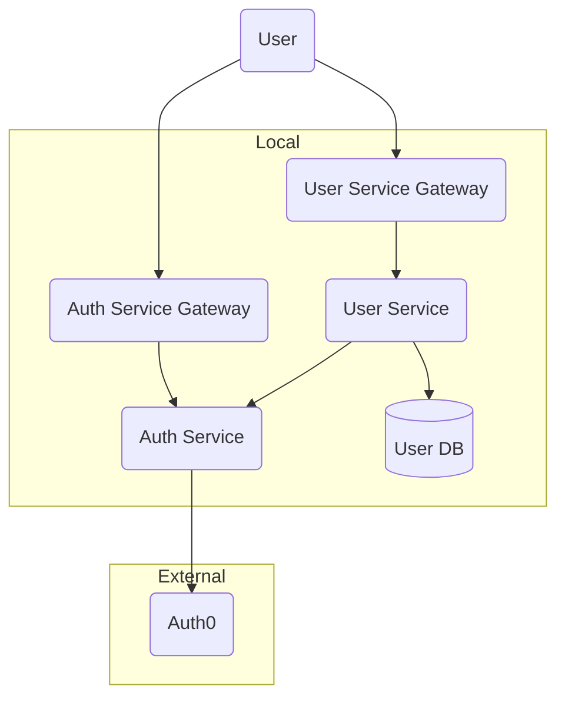

# Microservices Architecture Demo

- Auth Service
- User Service

```mermaid
flowchart TD
    user(User)

    subgraph local[Local]
        auth_service(Auth Service)
        auth_service_gateway(Auth Service Gateway)
        user_service(User Service)
        user_service_gateway(User Service Gateway)

        user_db[(User DB)]
    end

    subgraph external[External]
        auth0(Auth0)
    end

    user --> auth_service_gateway
    user --> user_service_gateway

    auth_service_gateway --> auth_service --> auth0
    user_service_gateway --> user_service

    user_service --> auth_service

    user_service --> user_db
```
